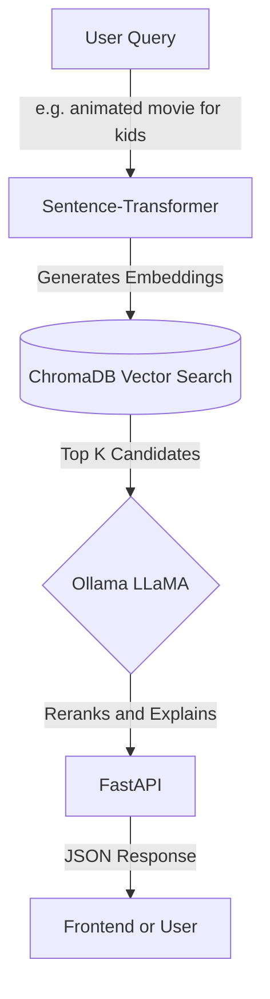

# 🎬 Movie Recommendation AI


[](https://fastapi.tiangolo.com/)
[](https://reactjs.org/)
[](https://vitejs.dev/)
[](https://trychroma.com/)
[](https://ollama.ai/)

A production-grade, AI-powered movie recommendation engine. It combines the blazing-fast vector search capabilities of **ChromaDB** with the reasoning power of local LLMs via **Ollama** to deliver hyper-personalized movie suggestions with human-readable explanations.

---

## 🌟 Key Features

- **Semantic Search**: Understands complex queries like *"mind-bending sci-fi thriller like Inception"*.
- **AI Reranking & Reasoning**: Uses an LLM to evaluate candidates and explain *why* you'll love them.
- **Personalization**: Learns from your search history and biases results toward your unique taste.
- **Local First**: Runs embeddings and LLM inference locally—no expensive API keys needed!
- **Modern Stack**: Built with FastAPI (Backend) and React/Vite (Frontend).

---

## 🏗️ Architecture Overview

For an in-depth breakdown of the system design, data flow, and components, please read the [Architecture Documentation](architecture.md).

### How It Works (High Level)



---

## 📂 File Structure

```text
movie-recommender-ai/
├── src/movie_recommender/
│   ├── config.py               # Pydantic settings — all config in one place
│   ├── logging_config.py       # Structured logging setup
│   ├── data/
│   │   ├── movielens_loader.py # Loads raw CSVs into DataFrames
│   │   └── preprocess.py       # Cleans, filters, builds text_blob per movie
│   ├── embeddings/
│   │   └── embedder.py         # Sentence-transformer wrapper
│   ├── vector_db/
│   │   └── chroma_client.py    # ChromaDB client — create, upload, search
│   ├── llm/
│   │   └── ollama_client.py    # Ollama API wrapper
│   ├── recommender/
│   │   ├── retrieve.py         # Embed query → search ChromaDB → candidates
│   │   ├── rerank.py           # Send candidates to LLM → ranked + reasons
│   │   └── pipeline.py         # retrieve → rerank in one function call
│   ├── db/
│   │   └── sqlite_store.py     # Persist queries + results to SQLite
│   └── api/
│       └── main.py             # FastAPI app — /recommend, /history endpoints
├── frontend/                   # React + Vite Frontend UI
├── scripts/
│   ├── build_index.py          # One-time: embed all movies + upload to ChromaDB
│   └── download_movielens.py   # One-time: download MovieLens dataset
├── data/
│   ├── raw/                    # Extracted MovieLens CSVs (gitignored)
│   └── processed/              # Parquet + SQLite files (gitignored)
├── chroma_storage/             # ChromaDB persistence (gitignored)
├── tests/
├── pyproject.toml
└── README.md
```

---

## 🚀 Quickstart (Local Development)

### 1. Clone the repo

```bash
git clone https://github.com/DigontaDas/Movie-Recommendation-AI.git
cd Movie-Recommendation-AI
```

### 2. Set up the Backend (FastAPI)

```bash
# Create and activate virtual environment
python -m venv .venv

# Windows
.venv\Scripts\activate
# Mac / Linux
source .venv/bin/activate

# Install dependencies
pip install -e .
pip install pydantic-settings structlog chromadb pyarrow
```

### 3. Download the MovieLens dataset

Go to [grouplens.org/datasets/movielens](https://grouplens.org/datasets/movielens/) and download **ml-latest-small.zip**. Extract it so your folder looks like this:

```text
data/raw/ml-latest-small/
├── movies.csv
├── ratings.csv
├── tags.csv
└── links.csv
```

### 4. Build the ChromaDB index

```bash
python scripts/build_index.py
```

### 5. Start the API

```bash
uvicorn movie_recommender.api.main:app --reload
```
Open your browser at **[http://localhost:8000/docs](http://localhost:8000/docs)** to see the interactive Swagger UI.

### 6. Start the Frontend

Open a new terminal and run:

```bash
cd frontend
npm install
npm run dev
```

---


### Example API Request
```bash
curl -X POST http://localhost:8000/recommend \
  -H "Content-Type: application/json" \
  -d '{"query": "dark psychological thriller", "top_k": 5}'
```

### Example API Response
```json
{
  "query_id": "1",
  "query": "dark psychological thriller",
  "recommendations": [
    {
      "rank": 1,
      "movie_id": "318",
      "title": "The Shawshank Redemption",
      "year": "1994",
      "genre": "Drama",
      "score": 0.94,
      "reason": "A gripping psychological drama with dark themes of injustice and resilience.",
      "poster_url": null
    }
  ]
}
```
