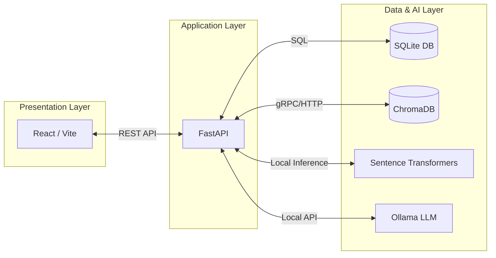
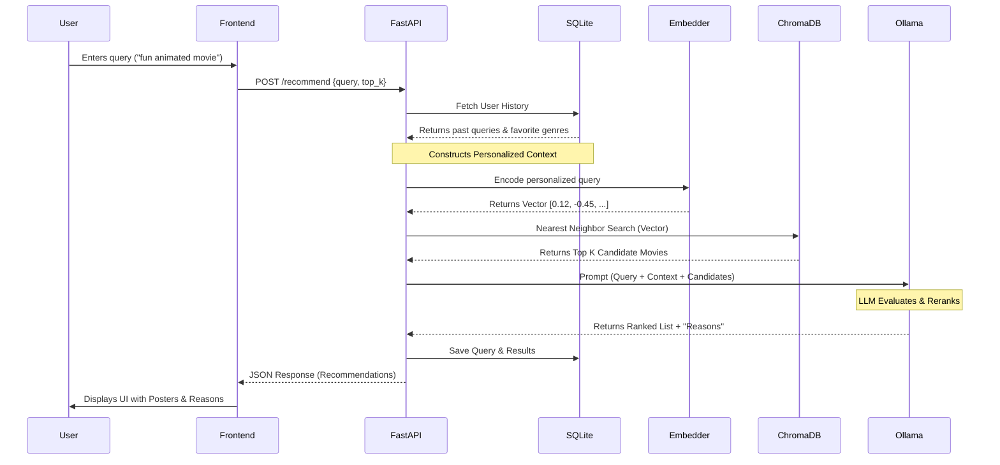

# System Architecture

The Movie Recommendation AI is designed as a decoupled, full-stack application leveraging modern machine learning pipelines, a robust backend API, and a reactive frontend.

## 1. High-Level Architecture

The system is composed of three main layers:
1. **Presentation Layer (Frontend)**: React/Vite application.
2. **Application Layer (Backend)**: FastAPI application orchestrating the recommendation pipeline.
3. **Data & AI Layer**: Local SQLite database, ChromaDB vector store, Sentence Transformers, and Ollama.

---

## 2. Component Breakdown

### 2.1. Presentation Layer (Frontend)
- **Framework**: React 19 + Vite.
- **Styling**: TailwindCSS 4 for responsive, modern UI design.
- **Routing**: React Router DOM.
- **State Management**: React hooks and `react-use`.
- **Purpose**: Provides the user interface for authenticating, searching for movies, viewing history, and managing user profiles. Communicates exclusively with the FastAPI backend via REST.

### 2.2. Application Layer (Backend - FastAPI)
- **API Framework**: FastAPI for high-performance, asynchronous endpoints.
- **Authentication**: Custom JWT-based authentication with HMAC signatures.
- **Core Endpoints**:
  - `/recommend`: The heart of the application. Triggers the Retrieval-Augmented Generation (RAG) pipeline.
  - `/auth/*`: User registration and login mechanisms.
  - `/profile/*`: User profile management, including Cloudinary integration for avatar/banner uploads.
  - `/history/*`: Retrieval of past user queries and AI recommendations.

### 2.3. Data & AI Layer
- **Relational Database (SQLite)**: 
  - Managed via `aiosqlite`. 
  - Stores user profiles, authentication credentials (hashed passwords + salts), watchlists, and search history.
- **Vector Database (ChromaDB)**: 
  - Stores high-dimensional vector embeddings of movie metadata (descriptions, genres, titles).
  - Used for lightning-fast semantic similarity searches based on user queries.
- **Embedding Model (Sentence-Transformers)**: 
  - Converts natural language user queries (e.g., "dark thriller") into vector embeddings. 
  - Runs locally within the FastAPI application context.
- **Large Language Model (Ollama)**: 
  - Runs a local LLaMA model natively on the host machine.
  - Acts as the "Re-ranker and Explainer". It receives the top candidates from ChromaDB alongside the user's historical context, then outputs a reranked list with personalized, human-readable explanations.
- **Media Storage (Cloudinary)**: 
  - External cloud service used to store user-uploaded profile avatars and banners.

---

## 3. Data Flow: The Recommendation Pipeline

When a user submits a query, the system executes a sophisticated Retrieval-Augmented Generation (RAG) workflow:

1. **Query Construction & Personalization**:
   - The backend retrieves the user's search history from SQLite.
   - It identifies recurring themes, favorite genres, and frequent titles to build a "Personalized Context".
2. **Vector Retrieval**:
   - The query is passed to the `Sentence-Transformer` model to generate a dense vector representation.
   - The vector is sent to `ChromaDB` to perform a nearest-neighbor search, retrieving the Top-K candidate movies based on semantic similarity.
3. **LLM Reranking**:
   - The candidate movies, the original query, and the personalized context are compiled into a strict prompt.
   - The prompt is sent to the local `Ollama` instance.
   - The LLM evaluates how well each candidate fits the query and the user's taste, assigns a new score, and generates a short, persuasive explanation.
4. **Persistence & Response**:
   - The final reranked list and the user's query are saved to SQLite for future context.
   - The JSON response is sent back to the React frontend to be displayed.

---

## 4. Deployment Architecture Considerations

### Current Strategy: Local-First
The application is currently optimized for local execution to avoid API costs, simplify development, and preserve user privacy. 

### Production Deployment Strategy
To deploy this stack to production on the cloud:

- **Frontend**: Deployed to edge networks like **Vercel** or **Netlify**.
- **Backend API**: Deployed to a persistent VPS (Virtual Private Server) like **Render**, **Railway**, or **AWS EC2**. Serverless functions (like Vercel serverless) *cannot* be used due to ChromaDB's requirement for persistent local disk access and the memory footprint of embedding models.
- **LLM Engine (Ollama)**: Hosted on the same VPS if sufficient resources (minimum 8GB RAM, ideally a GPU) are available. Alternatively, offloaded to a dedicated GPU cloud provider like **RunPod** or **Replicate**.
- **Database (Optional Upgrade)**: The local SQLite database can be migrated to a managed PostgreSQL instance (e.g., Supabase, Neon) for better scalability and concurrent connections.
